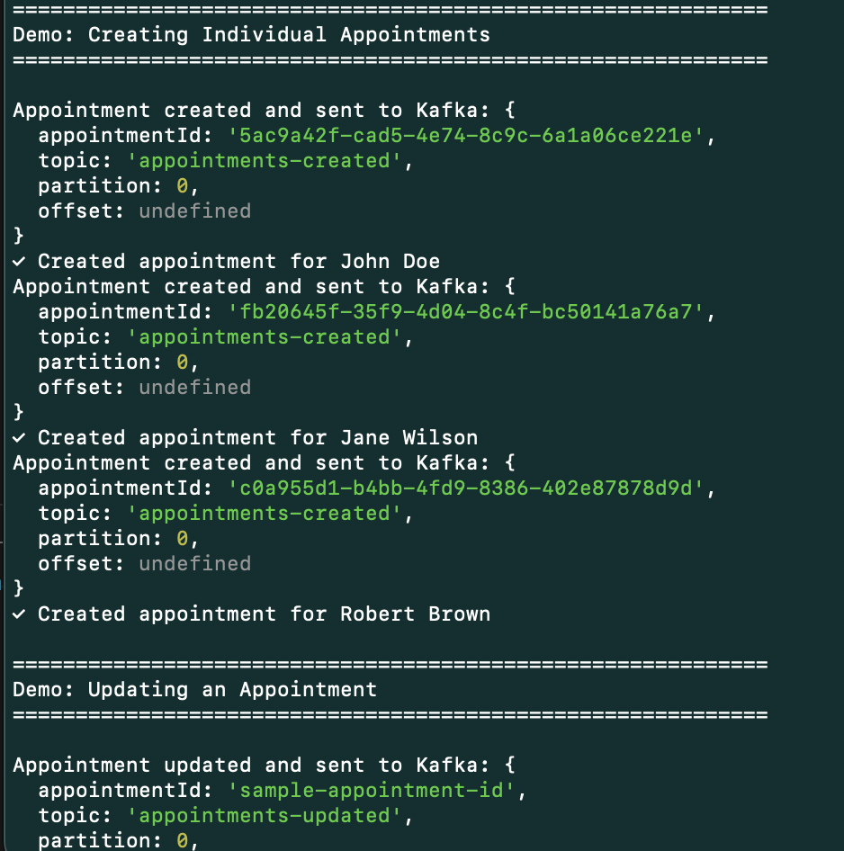
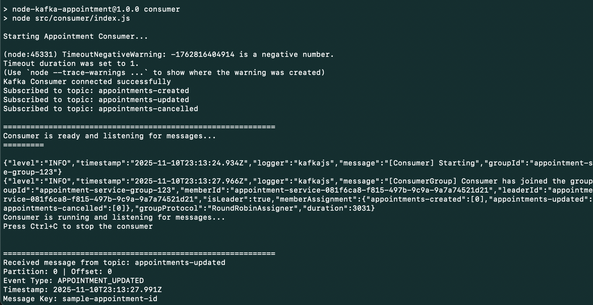

# Node.js Kafka Appointment System by Franco





A complete Kafka-based appointment management system built with Node.js, featuring producer and consumer services running on a single-node Kafka broker with Docker.

## Project Structure

```
node-kafka-appointment/
├── docker-compose.yml          # Docker configuration for Kafka and Zookeeper
├── package.json               # Node.js dependencies and scripts
├── README.md                  # This file
└── src/
    ├── config/
    │   └── kafka.config.js    # Kafka connection and topic configuration
    ├── models/
    │   └── appointment.model.js # Appointment data model
    ├── producer/
    │   ├── appointment.producer.js # Producer service implementation
    │   └── index.js           # Producer entry point with examples
    └── consumer/
        ├── appointment.consumer.js # Consumer service implementation
        └── index.js           # Consumer entry point with handlers
```

## Features

- Single-node Kafka broker setup with Docker
- Appointment producer service with CRUD operations
- Appointment consumer service with custom event handlers
- Support for multiple topics (created, updated, cancelled)
- Batch message processing
- Graceful shutdown handling
- Message validation
- Unique appointment IDs using UUID

## Prerequisites

- Node.js (v14 or higher)
- Docker and Docker Compose
- npm or yarn

## Installation

1. Install Node.js dependencies:

```bash
npm install
```

## Running the Application

### Step 1: Start Kafka Broker

Start the Kafka broker and Zookeeper using Docker Compose:

```bash
docker-compose up -d
```

Verify that containers are running:

```bash
docker-compose ps
```

You should see:
- `zookeeper` - Running on port 2181
- `kafka-broker` - Running on ports 9092 and 9093

Check Kafka logs:

```bash
docker-compose logs -f kafka
```

### Step 2: Start the Consumer

Open a new terminal and start the consumer service:

```bash
npm run consumer
```

The consumer will:
- Connect to Kafka broker
- Subscribe to all appointment topics
- Listen for incoming messages
- Process messages with custom handlers

### Step 3: Start the Producer

Open another terminal and start the producer service:

```bash
npm run producer
```

The producer will:
- Connect to Kafka broker
- Create sample appointments
- Send messages to various topics
- Demonstrate update and cancel operations
- Send batch messages

## Development Mode

For development with auto-restart on file changes:

```bash
# Terminal 1: Start consumer in dev mode
npm run dev:consumer

# Terminal 2: Start producer in dev mode
npm run dev:producer
```

## Kafka Topics

The system uses the following Kafka topics:

- `appointments-created` - New appointment events
- `appointments-updated` - Appointment update events
- `appointments-cancelled` - Appointment cancellation events

## API Usage Examples

### Creating an Appointment

```javascript
const AppointmentProducer = require('./src/producer/appointment.producer');

const producer = new AppointmentProducer();
await producer.connect();

const appointment = await producer.createAppointment({
  patientName: 'John Doe',
  doctorName: 'Dr. Sarah Smith',
  appointmentDate: '2025-11-15',
  appointmentTime: '10:00 AM',
  reason: 'Regular checkup',
  status: 'SCHEDULED'
});
```

### Updating an Appointment

```javascript
await producer.updateAppointment('appointment-id-here', {
  appointmentDate: '2025-11-18',
  appointmentTime: '03:00 PM',
  status: 'CONFIRMED'
});
```

### Cancelling an Appointment

```javascript
await producer.cancelAppointment('appointment-id-here', 'Patient requested reschedule');
```

### Batch Creating Appointments

```javascript
const appointments = [
  { patientName: 'Alice', doctorName: 'Dr. Wilson', /* ... */ },
  { patientName: 'Bob', doctorName: 'Dr. Anderson', /* ... */ }
];
await producer.sendBatch(appointments);
```

### Custom Consumer Handlers

```javascript
const AppointmentConsumer = require('./src/consumer/appointment.consumer');

const consumer = new AppointmentConsumer('my-consumer-group');
await consumer.connect();
await consumer.subscribe([TOPICS.APPOINTMENTS_CREATED]);

await consumer.run({
  onAppointmentCreated: async (appointment, message) => {
    // Your custom logic here
    console.log('New appointment:', appointment);
    // Save to database, send emails, etc.
  }
});
```

## Appointment Data Model

```javascript
{
  id: 'uuid-v4',
  patientName: 'string',
  doctorName: 'string',
  appointmentDate: 'YYYY-MM-DD',
  appointmentTime: 'HH:MM AM/PM',
  reason: 'string',
  status: 'SCHEDULED|CONFIRMED|CANCELLED|COMPLETED',
  createdAt: 'ISO-8601 timestamp',
  updatedAt: 'ISO-8601 timestamp'
}
```

## Docker Commands

```bash
# Start Kafka and Zookeeper
docker-compose up -d

# Stop services
docker-compose down

# View logs
docker-compose logs -f

# View specific service logs
docker-compose logs -f kafka
docker-compose logs -f zookeeper

# Restart services
docker-compose restart

# Remove all containers and volumes
docker-compose down -v
```

## Kafka Management

### List Topics

```bash
docker exec -it kafka-broker kafka-topics --bootstrap-server localhost:9092 --list
```

### Describe a Topic

```bash
docker exec -it kafka-broker kafka-topics --bootstrap-server localhost:9092 --describe --topic appointments-created
```

### View Messages in Topic

```bash
docker exec -it kafka-broker kafka-console-consumer --bootstrap-server localhost:9092 --topic appointments-created --from-beginning
```

### Delete a Topic

```bash
docker exec -it kafka-broker kafka-topics --bootstrap-server localhost:9092 --delete --topic appointments-created
```

## Troubleshooting

### Kafka Connection Issues

If you see connection errors:

1. Ensure Docker containers are running:
   ```bash
   docker-compose ps
   ```

2. Check if Kafka is ready:
   ```bash
   docker-compose logs kafka | grep "started"
   ```

3. Wait 30-60 seconds after starting Docker Compose for Kafka to fully initialize

### Consumer Not Receiving Messages

1. Verify consumer is subscribed to correct topics
2. Check consumer group is active:
   ```bash
   docker exec -it kafka-broker kafka-consumer-groups --bootstrap-server localhost:9092 --list
   ```

3. Check consumer:
   ```bash
   docker exec -it kafka-broker kafka-consumer-groups --bootstrap-server localhost:9092 --describe --group appointment-service-group-123
   ```

### Port Already in Use

If ports 9092 or 2181 are already in use:

1. Stop existing services using those ports
2. Or modify the ports in `docker-compose.yml`

## Configuration

### Kafka Configuration

Edit `src/config/kafka.config.js` to modify:
- Broker addresses
- Client ID
- Topic names
- Retry settings

### Docker Configuration

Edit `docker-compose.yml` to modify:
- Port mappings
- Kafka broker settings
- Zookeeper configuration
- Network settings

## Production Considerations

Improvement for production deployments:

1. Multiple Kafka brokers for high availability
2. Increased replication factor for topics
3. Persistent volumes for data storage
4. Monitoring and logging solutions
5. Security configurations (SSL/SASL)
6. Error handling and dead letter queues
7. Message schema validation
8. Consumer group management
9. Backup and disaster recovery

## License

MIT

## https://developer.confluent.io/get-started/javascript/#consume-events

## Contributing

Feel free to submit issues and enhancement requests.

Developed by Franco Gutierrez | 2025 | SUGI FKMS LTD
